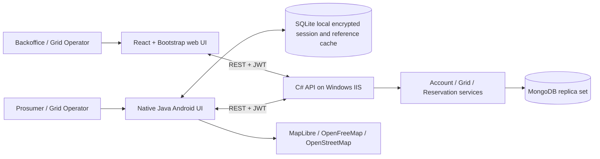
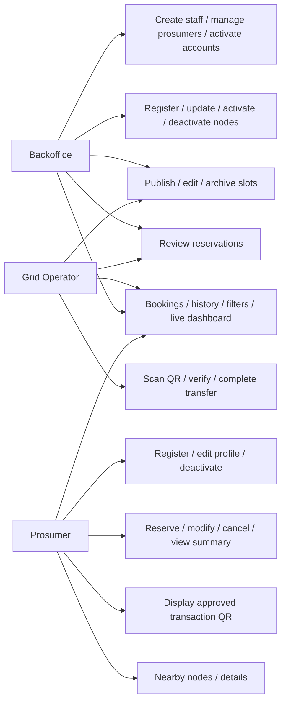
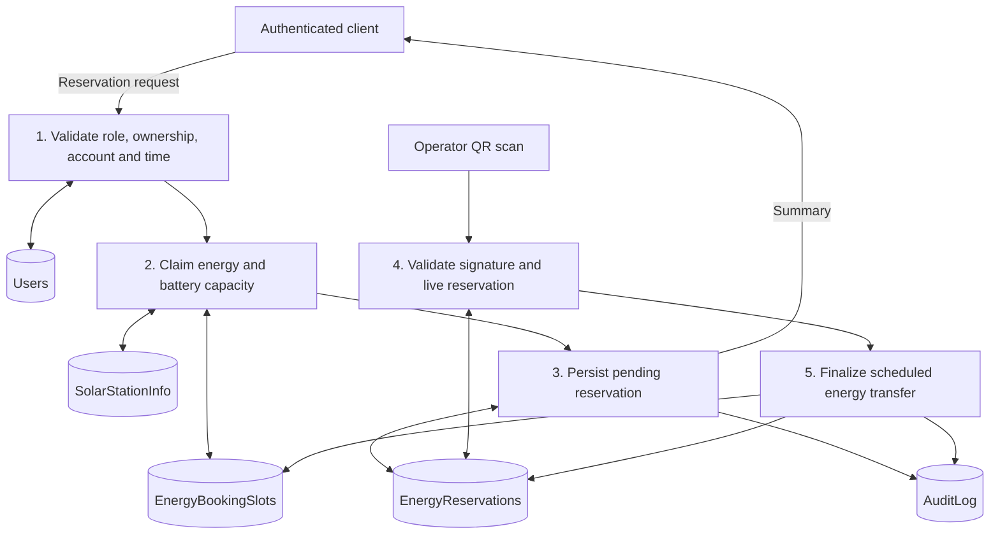
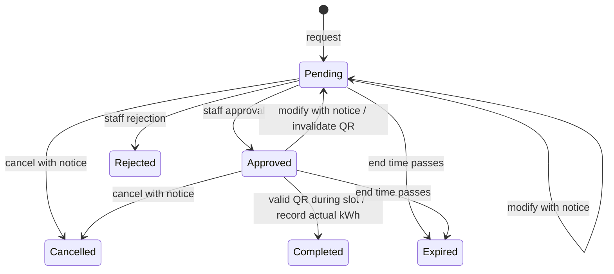

# Solara system design

## Architecture

The controllers are thin adapters. Services enforce authorization-related ownership, booking time limits, account states, capacity and transfer transitions. MongoDB transactions atomically commit bookings, slot counters and audit records. Clients display server responses and never query MongoDB.

## Use cases

## Data flow

## Database model

| Collection | Primary identifier | Main fields and references |
|---|---|---|
| Users | NIC for prosumers; generated ID for staff | NIC, name, unique normalized email, phone, address, password hash, role, status, token version, creation time |
| SolarStationInfo | Generated node ID | Name, address, GPS latitude/longitude, capacity kW, battery slots, schedule, active flag, revision |
| EnergyBookingSlots | Generated slot ID | Station ID, UTC start/end, capacity kWh, max bookings, reserved kWh/count, active flag |
| EnergyReservations | Generated booking ID | Prosumer ID, station ID, slot ID, copied scheduled interval, energy, direction, status, QR nonce, revision, completion operator/time/energy |
| AuditLog | Generated event ID | Actor, action, entity ID, UTC timestamp |

Unique email indexes prevent duplicate accounts; Mongo `_id` uniqueness enforces NIC identity. Indexes support station/time, prosumer/status/time and station/status queries. Node and slot archival retains valid history references.

## Reservation lifecycle

The planning defaults are Backoffice-only account activation and review by either staff role. These choices, deletion versus archival, capacity units and completion window interpretation need lecturer confirmation because the brief does not specify every detail.

## Security decisions

Passwords use ASP.NET's salted password hasher. Signed expiring JWTs are rechecked against current activation/token version on every request. QR payloads use a distinct HMAC key, current random nonce, server-state verification and transaction-protected single completion. Android stores encrypted session JSON in SQLite using Android Keystore, without raw passwords. Release transport uses HTTPS; HTTP is permitted only for Android debug development.

## Challenges and actual evidence

The machine initially lacked the .NET SDK, Java and Android SDK, MongoDB and IIS. Workspace-local tools enable build and database checks without committing their binaries. A first package restore caught vulnerable transitive compression packages; the MongoDB driver was updated. Real integration tests cover transaction races rather than testing a mocked counter.

Contributions, screenshots, successful IIS deployment, actual device/map/scanner observations and viva reflection must be recorded from real work. Do not treat this design document as evidence that those activities occurred.
